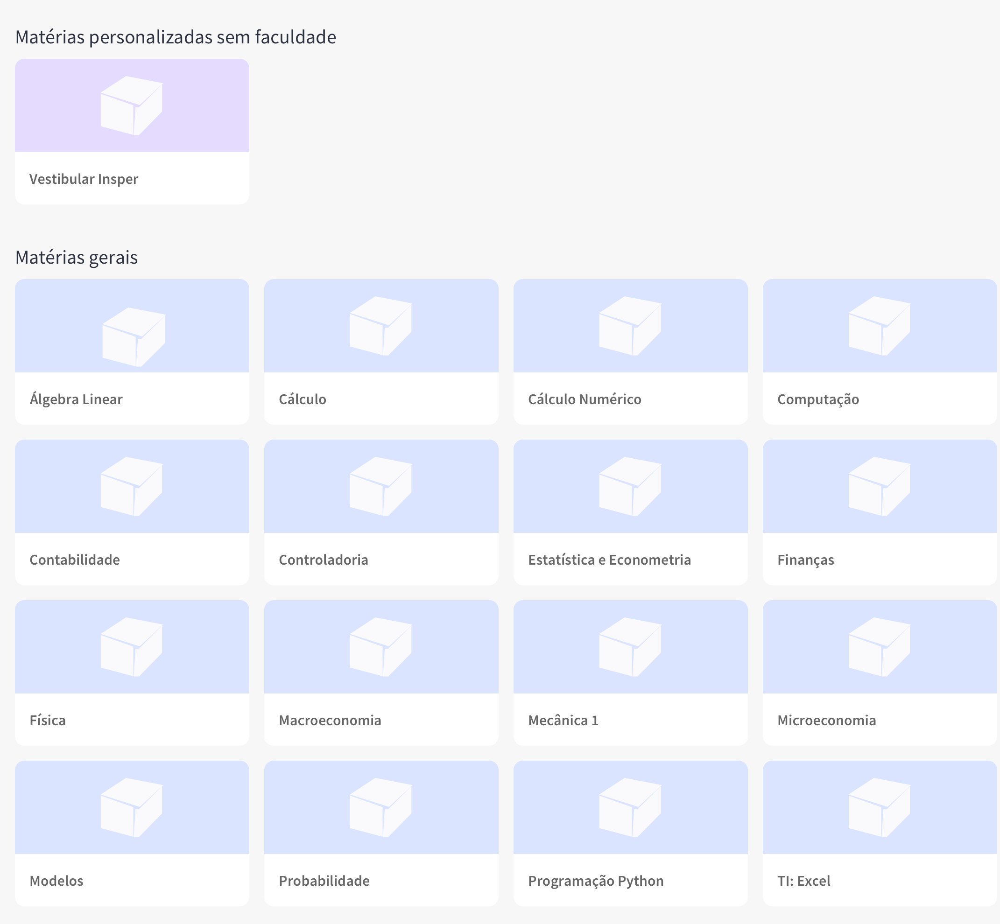

Desafio de recrutamento de full-stack
====================================
Este repositório contém o desafio de recrutamento para a vaga de full-stack da Estudar com Você.

Este desafio tem como objetivos avaliar seu conhecimento técnico, aprendizado, e como você lida com prazos, requisitos e com uma situação muito semelhante às que você enfrentará no trabalho.

---
## Descrição do desafio

Seu objetivo será implementar um mockup da dashboard do nosso site e uma página de gerenciamento das matérias.

A dashboard é a nossa página principal, para o qual o aluno é levado após o login. Nela apresentamos todas as matérias para o aluno e ele pode explorar as matérias que oferecemos para a sua faculdade, e a partir dela chegar ao conteúdo que ele deseja estudar. Se você já usou algum site de cursos online (eg. *Coursera, Khan Academy, Duolingo...*) ou serviços de vídeo como *YouTube* ou *Netflix* você pode estar familiarizado com a função que a dashboard desempenha.

A página de gerenciamento das matérias é onde nós criamos as matérias que serão exibidas aos alunos. Além do processo de criação, nessa página conseguimos editar uma matéria quando necessário, e também podemos excluí-la. Basicamente, esta página conta com as quatro operações básicas usadas em banco de dados relacionais, também conhecida CRUD (Create, Read, Update e Delete).

## Detalhes

Sua missão será criar uma página onde fazemos todo o gerenciamento das matérias persistidas em um banco de dados relacional. Nós temos matérias personalizadas (matérias que criamos para faculdades específicas) e matérias gerais, em ambos os tipos temos os seguintes dados: **Nome** e **Descrição**. Além disso, as vezes queremos esconder uma matéria da dashboard, mas não necessariamente excluímos ela, apenas deixamos invisível ao usuário, mantendo o registro na base de dados. Um outro ponto, quando uma matéria é criada, gostaríamos de mostrar ao usuário que a matéria é nova.

A outra parte da missão envolve a criação de uma dashboard de listagem de matérias, separadas entre matérias personalizadas e matérias gerais.

**Não se preocupe em reproduzir o design da nossa tela**, ela está incluída apenas como inspiração, o que iremos analisar é como você **cria**, **persiste** e **exibe os dados** e que seja **funcional**.

Você tem total liberdade para decidir qual stack / tecnologias irá utilizar.

Estamos fornecendo na pasta assets um json contendo alguns dados (nome e descrição) de matérias para ter um ponto de partida.

## Critérios de avaliação

A sua solução será avaliada segundo os seguintes critérios.

- Funcionalidade
- Prazo (não estamos definindo um prazo no qual o desafio deve ser 	concluído, a solução que o candidato julgar como final e o tempo 	necessário para se chegar a ela serão critérios de avaliação).

Definimos também critérios que não são absolutamente necessários mas valem pontos extras:

- Login para acesso aos dados com diferentes níveis de acesso;
- Incluir alguma funcionalidade extra.

## Entregáveis

A solução deve ser entregue na forma de um link para um repositório hospedando o seu código, o README deve conter instruções de como executá-lo.

---
Qualquer duvida entre em contato conosco.  
Boa Sorte!  
Equipe Estudar com Você